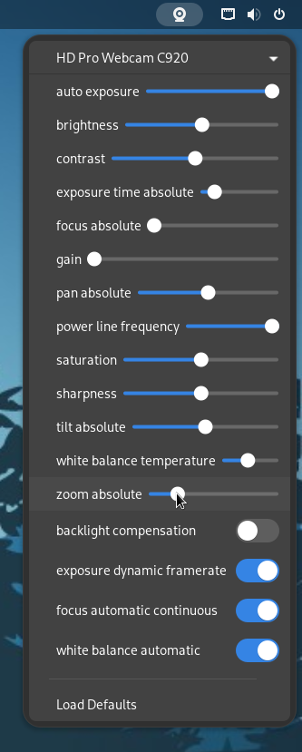

# Gnome Extension V4L

Simple Gnome extension to control your webcam settings via the top panel



## Install

[v4l-utils](https://man.archlinux.org/man/v4l2-ctl.1) must be installed.

```
# Arch
pacman -S v4l-utils

# Debian
apt-get install v4l-utils

# Fedora
dnf install v4l-utils
```

Then copy the src files into a subfolder of _gnome-shell/extensions_ or use the script:

```bash
git clone https://github.com/bztes/gnome-extension-v4l.git
cd gnome-extension-v4l
make install
```

## Uninstall

Simply remove the extension folder or use the script:

```bash
cd gnome-extension-v4l
make remove
```
